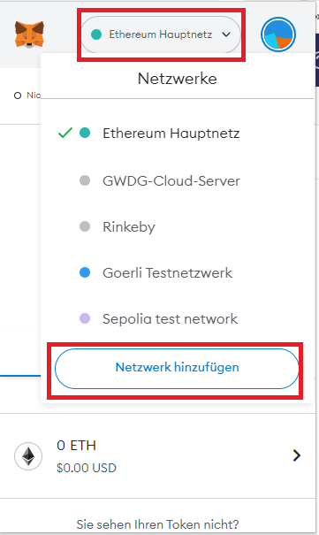
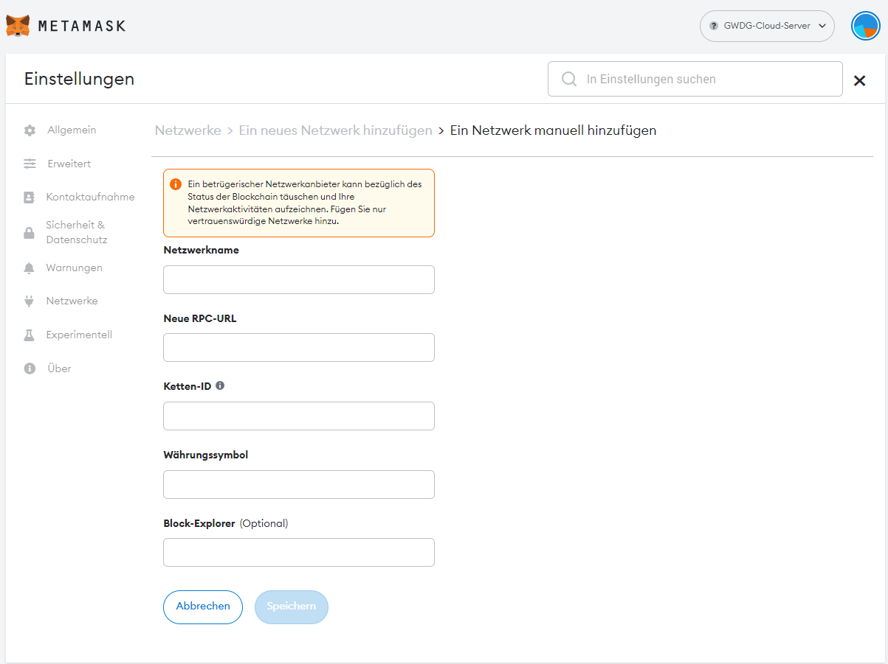
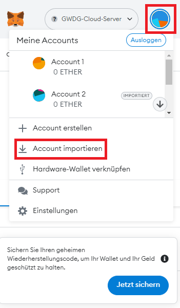

# LUCID APP

Anwendung zum Abwickeln des Zollimportprozesses und Zollanmeldung auf Basis von u. a. React, Django und Ethereum.

## Getting started

- [ ] Starten des Docker-Images 
- [ ] Import der Demo-Daten
- [ ] Installieren und Einrichten von MetaMask

## GIT Download unter Windows

Um die richtigen Line-Break Characters für das Linux System im DockerImage zu nutzen und so die Entrypoint Skripte ausführbar zu machen, muss der Clone-Befehl um eine Option erweitert werden:

    git clone https://github.com/stephangn/lucidapp_container.git --config core.autocrlf=input

## Starten der Container 

Ausführen per Docker (vorausgesetzt ist eine aktuelle Docker Installation - sofern nicht Docker Desktop eingesetzt wird, muss Docker Compose extra installiert werden und die Befehle lauten docker-compose statt Docker compose)

Bauen des Container 

    docker compose build 

Starten des Containers

    docker compose up -d 

## Importieren der Testdaten

Zurücksetzen der Datenbank 

    docker compose exec web python manage.py flush

Importieren der Testdaten 

    docker compose exec web python manage.py loaddata database_demo.json

Bei Problemen anzeigen der Server-Logs 

    docker compose logs -f 

Anschließend ist das Backend unter [localhost:8000](http://localhost:8000) erreichbar. 

### Hinweise 

\* Die in den verlinkten Testdaten sichtbaren Dokumente sind nicht zu sehen. Erst neu angelegte Dokumente sind abrufbar.

\* Mögliche Dokumente sind unter Testdaten abgelegt

\* Nach dem Beenden und löschen des Containers und des Volumes sind die Daten zu Entwicklungszwecken zurückgesetzt

## MetaMask

### 1. MetaMask installieren

MetaMask ist ein Browser-Plugin und kann unter https://metamask.io/download/ heruntergeladen werden. Bitte beachten Sie dabei einen kompatiblen Browser (Chrome, Firefox, Brave, Edge oder Opera) zu nutzen.

### 2. Hinzufügen des Blockchain-Netzwerkes

Öffnen Sie in der Metamask-Browsererweiterung oben das Dropdown-Menü "Netzwerke" und wählen Sie den Menüpunkt "Netzwerk hinzufügen":

### 3. Eingeben der Daten des Blockchain-Netzwerkes

Im sich neu geöffneten Tab werden Sie dann aufgefordert die Daten des Servers einzugeben.

Wichtig hierbei ist die korrekte Eingabe der RPC-URL und der Ketten-ID. Diese werden im Docker-Compose-File festgelegt.
Bei z. B. Localhost (standardmäßig) - RPC-URL: http://localhost:8545, Ketten-ID: 1337

### 4. Account importieren

Als nächstes müssen die für den Testbetrieb freigegebenen Accounts importiert werden. Die Private Keys befinden sich im Hauptverzeichnis in der Datei "accounts". Darüber hinaus sind weitere Public-Private-Key-Pairs in keys.txt
Zum Importieren öffnen Sie MetaMask und klicken auf das runde Symbolbild oben rechts. Anschließend gehen Sie auf "Account importieren".

Im darauffolgenden Dialogfenster können Sie den kopierten Private Key einfügen.

### Problem-Behandlung

Wird der Zustand der Blockchain zurückgesetzt (z. B. durch löschen von des Ordners "ganache_data") ist es notwendig alle Accounts einzeln in MetaMask zurückzusetzen, ansonsten werden Transaktionen nicht ausgeführt und Client kann nicht mit Node kommunizieren. 
Hierfür:
Klick auf Accountsymbol -> Einstellungen -> Erweitert -> Account zurücksetzen

## Anwendung

\* Das System ist unter [localhost:3000](http://localhost:3000) erreichbar. 

\* Zugangsdaten befinden sich in der Datei "accounts"

## Name

LUCID: Lightweight unified customs and invoice declaration

## License

Lehrstuhl für Anwendungssysteme und E-Business der Universität Göttingen
